# Jaktra SEO Content Strategy & Keyword Architecture

**Document Version:** 1.0  
**Effective Date:** September 2026  
**Domain:** `https://jaktra.site` / `https://www.jaktra.site`  
**Target Search Audience:** CFOs, VPs of Finance, Corporate Controllers, AR/Credit Managers at B2B companies ($2M–$50M ARR).

---

## 1. Executive Summary & Market Positioning

Jaktra is positioned in search as the **Autonomous AI Accounts Receivable & Dunning Agent** for B2B finance teams. Unlike legacy AR suites (which function as manual phone task loggers or heavy multi-month ERP modules) and traditional dunning mailers (which blast static, repetitive email templates), Jaktra's SEO presence captures high-intent finance searches around:

1. **Autonomous Collections Execution:** Moving past manual calling lists and static calendar templates.
2. **5-Stage Tone Escalation & AI Generation:** Psychology-backed dunning copy tailored to debtor history.
3. **Dispute Triage & AR Query Management:** Automated sentiment detection that halts dunning and drafts resolution responses.
4. **Zero-Login Payment Portals & Installment Plans:** Reducing payment friction via tokenized `/i/:token` links.
5. **Alternative to Legacy AR Software:** Objective, balanced comparisons against HighRadius, Upflow, Chaser, PaidNice, and Kolleno.

---

## 2. Complete Content Inventory & Target Keyword Matrix (39 Live Routes)

All 39 URLs listed below are verified live in production, server-side pre-rendered (full DOM), schema-validated, and auto-indexed in `sitemap.xml`.

### 2.1 Core Hubs & Platform Landing

| URL Path | Primary Keyword | Secondary / LSI Keywords | Search Intent | Schema Types |
| :--- | :--- | :--- | :--- | :--- |
| `/` | AI accounts receivable automation | autonomous AR collections agent, automated dunning software, B2B debt recovery AI | Commercial / Navigational | `Organization`, `WebSite`, `SoftwareApplication`, `FAQPage` |
| `/pricing` | accounts receivable automation pricing | free accounts receivable software, DSO reduction ROI, early access AR software | Commercial / Transactional | `SoftwareApplication`, `Offer`, `BreadcrumbList` |
| `/features` | B2B accounts receivable features | dunning features, dispute management tools, zero-login payment links | Commercial / Informational | `CollectionPage`, `BreadcrumbList` |
| `/use-cases` | accounts receivable by industry | AR automation use cases, industry dunning software, vertical debt collection | Commercial / Informational | `CollectionPage`, `BreadcrumbList` |
| `/compare` | accounts receivable software comparison | best AR automation tools, dunning software alternatives, HighRadius Upflow Chaser comparison | Commercial / Investigative | `CollectionPage`, `BreadcrumbList` |
| `/resources` | accounts receivable guides and templates | B2B dunning templates, DSO guides, invoice dispute response templates | Informational | `CollectionPage`, `BreadcrumbList` |
| `/docs` | Jaktra documentation | Jaktra API, SendGrid integration setup, Razorpay webhook AR setup | Navigational / Technical | `TechArticle`, `BreadcrumbList` |
| `/privacy` | Jaktra privacy policy | AR software data security, financial compliance privacy | Legal / Navigational | `WebPage`, `BreadcrumbList` |
| `/terms` | Jaktra terms of service | software agreement, enterprise AR terms | Legal / Navigational | `WebPage`, `BreadcrumbList` |

---

### 2.2 Core Product Features (6 Pages)

| URL Path | Primary Keyword | Secondary / LSI Keywords | Search Intent | Key Schema |
| :--- | :--- | :--- | :--- | :--- |
| `/features/5-stage-escalation` | 5 stage tone escalation AR | dunning tone modulation, autonomous collections cadence, polite dunning workflow | Commercial / Informational | `TechArticle`, `BreadcrumbList` |
| `/features/dispute-triage` | AI invoice dispute triage | accounts receivable dispute management, inbound dispute sentiment analysis, AR cadence freeze | Commercial / Informational | `TechArticle`, `BreadcrumbList` |
| `/features/installment-plans` | self-serve invoice installment plans | B2B invoice installment payment, overdue debt split payment, automated milestone AR | Commercial / Informational | `TechArticle`, `BreadcrumbList` |
| `/features/zero-login-portal` | zero login debtor portal | tokenized invoice payment link, passwordless B2B debtor portal, frictionless invoice settlement | Commercial / Informational | `TechArticle`, `BreadcrumbList` |
| `/features/email-deliverability` | accounts receivable email deliverability | dunning email DLQ, spam blacklist protection AR, SendGrid Resend dunning bounce handler | Commercial / Technical | `TechArticle`, `BreadcrumbList` |
| `/features/risk-scoring` | predictive AR delinquency scoring | invoice default risk score, machine learning payment probability, accounts receivable risk triage | Commercial / Informational | `TechArticle`, `BreadcrumbList` |

---

### 2.3 Software Comparisons & Alternatives (6 Routes, 5 Distinct Competitors)

| URL Path | Primary Keyword | Secondary / LSI Keywords | Search Intent | Competitor Differentiation |
| :--- | :--- | :--- | :--- | :--- |
| `/compare/highradius-vs-jaktra` | HighRadius vs Jaktra | HighRadius alternative, enterprise O2C vs focused collections, HighRadius collections pricing | Commercial / Investigative | Enterprise lockbox OCR & SAP deductions vs focused 15-minute autonomous AI dunning |
| `/compare/highradius-alternative` | HighRadius alternative | lightweight HighRadius replacement, mid-market AR collections agent | Commercial / Investigative | Canonical alias to `/compare/highradius-vs-jaktra` |
| `/compare/upflow-alternative` | Upflow alternative | Upflow vs Jaktra, Upflow pricing, static dunning workflows vs AI agents | Commercial / Investigative | Static calendar drip rules vs Groq LLaMA 3.1 tone modulation & NLP triage |
| `/compare/chaser-alternative` | Chaser alternative | Chaser vs Jaktra, Chaser accounts receivable alternative, automated phone chasing software | Commercial / Investigative | Manual phone tracking logs vs autonomous digital agent & zero-login portal |
| `/compare/paidnice-alternative` | PaidNice alternative | PaidNice vs Jaktra, automated late fee software alternative, B2B invoice late fees PO match | Commercial / Investigative | Punitive compounding late fees (breaks POs) vs generative tone & installment plans |
| `/compare/kolleno-alternative` | Kolleno alternative | Kolleno vs Jaktra, Kolleno pricing, omnichannel AR workspace alternative | Commercial / Investigative | Omnichannel human calling queues ($12k+/yr) vs autonomous execution ($0 early access) |

---

### 2.4 Industry Vertical Use Cases (8 Pages)

| URL Path | Primary Keyword | Secondary / LSI Keywords | Search Intent | Target Customer Persona |
| :--- | :--- | :--- | :--- | :--- |
| `/use-cases/saas` | SaaS accounts receivable automation | B2B SaaS dunning, software contract invoice collection, net-30 SaaS churn AR | Commercial | SaaS VP Finance, RevOps, ARR $3M–$30M |
| `/use-cases/agencies` | digital agency invoice collections | agency billing dispute management, retainer invoice collections, client scope dispute AR | Commercial | Agency Owner, Finance Director |
| `/use-cases/manufacturing` | manufacturing accounts receivable automation | supply chain invoice dunning, manufacturing trade credit collections, bill of lading dispute | Commercial | Manufacturing Controller, VP Operations |
| `/use-cases/professional-services` | professional services AR automation | consulting billing dispute management, law firm invoice chasing, billable hours dispute | Commercial | Managing Partner, Billing Manager |
| `/use-cases/construction` | construction accounts receivable automation | progress billing collections, retention fee invoice chasing, mechanics lien milestone AR | Commercial | Construction CFO, General Contractor Credit Controller |
| `/use-cases/logistics-freight` | logistics accounts receivable software | freight bill dispute management, 3PL carrier invoice dunning, proof of delivery dispute AR | Commercial | Logistics Finance VP, Freight Controller |
| `/use-cases/staffing-recruiting` | staffing agency invoice collections | contingent workforce invoice dunning, recruitment fee dispute resolution, placement fee AR | Commercial | Staffing Agency Controller, Billing Team |
| `/use-cases/wholesale-distribution` | wholesale distribution AR automation | distributor trade credit dunning, volume rebate deduction clearing, wholesale buyer portal | Commercial | Wholesale Credit Manager, CFO |

---

### 2.5 Technical Guides, Templates & Calculator Resources (10 Pages)

| URL Path | Primary Keyword | Secondary / LSI Keywords | Search Intent | Key Asset / Value Hook |
| :--- | :--- | :--- | :--- | :--- |
| `/resources/how-to-reduce-dso` | how to reduce DSO | days sales outstanding formula, B2B DSO benchmark by industry, accounts receivable acceleration | Informational | Comprehensive 4,000-word tactical guide with DSO formulas and benchmarks |
| `/resources/5-stage-ar-tone-escalation` | dunning email tone escalation guide | accounts receivable email tone sequence, polite overdue invoice notices, legal stop escalation | Informational | Psychology-backed 5-stage communication playbook with copy examples |
| `/resources/b2b-dunning-email-templates` | B2B dunning email templates | past due invoice email template, friendly overdue invoice reminder copy, final demand letter template | Informational | 10+ copy-paste production-tested email templates across 5 urgency stages |
| `/resources/best-b2b-finance-automation-tools` | best B2B finance automation tools | top accounts receivable software 2026, AP vs AR automation stack, finance tech stack guide | Commercial / Informational | 14-platform comparative review across ERP, AP, AR, and Treasury layers |
| `/resources/ar-automation-roi-calculator` | accounts receivable ROI calculator | DSO reduction savings calculator, bad debt recovery ROI, finance team labor savings model | Interactive / Commercial | Interactive client-side ROI model calculating software and labor savings |
| `/resources/invoice-dispute-response-templates` | invoice dispute response templates | handling client invoice dispute letter, response to billing questions email, dispute resolution copy | Informational | Battle-tested response scripts for pricing, deliverable, and PO disputes |
| `/resources/accounts-receivable-query-management` | accounts receivable query management | AR query workflow, handling customer billing queries, billing enquiry resolution SLA | Informational | Framework for resolving client billing inquiries without delaying payment |
| `/resources/client-questioning-billable-hours` | client questioning billable hours | disputed billable hours response template, how to handle timesheet dispute, consulting billing dispute | Informational | De-escalation scripts and evidentiary logs for consulting and legal services |
| `/resources/client-disputed-invoice-what-to-do` | client disputed invoice what to do | step by step invoice dispute resolution, credit note vs dispute negotiation, preserving client goodwill AR | Informational | Standard Operating Procedure (SOP) for credit controllers facing client disputes |
| `/resources/how-to-manage-accounts-receivable-emails` | how to manage accounts receivable emails | AR shared inbox best practices, sorting incoming billing emails, dunning cadence pause SLA | Informational | Shared inbox management playbook and automated triage blueprint |

---

## 3. Content Pillars & Hub-and-Spoke Topology

Jaktra organizes its SEO footprint into **5 Interconnected Topic Clusters**:

```mermaid
graph TD
    Home["Homepage (/) - Autonomous AI AR Collections"] --> HubFeat["Features Hub (/features)"]
    Home --> HubUse["Use Cases Hub (/use-cases)"]
    Home --> HubComp["Compare Hub (/compare)"]
    Home --> HubRes["Resources Hub (/resources)"]

    HubFeat --> F1["5-Stage Escalation"]
    HubFeat --> F2["Dispute Triage"]
    HubFeat --> F3["Installment Plans"]
    HubFeat --> F4["Zero-Login Portal"]
    HubFeat --> F5["Email Deliverability (DLQ)"]
    HubFeat --> F6["AI Risk Scoring"]

    HubComp --> C1["HighRadius Comparison"]
    HubComp --> C2["Upflow Alternative"]
    HubComp --> C3["Chaser Alternative"]
    HubComp --> C4["PaidNice Alternative"]
    HubComp --> C5["Kolleno Alternative"]

    HubUse --> U1["B2B SaaS"]
    HubUse --> U2["Digital Agencies"]
    HubUse --> U3["Manufacturing"]
    HubUse --> U4["Professional Services"]
    HubUse --> U5["Construction"]
    HubUse --> U6["Logistics & Freight"]
    HubUse --> U7["Staffing & Recruiting"]
    HubUse --> U8["Wholesale Distribution"]

    HubRes --> R1["How to Reduce DSO"]
    HubRes --> R2["Dunning Email Templates"]
    HubRes --> R3["Dispute Response Templates"]
    HubRes --> R4["AR ROI Calculator"]
    HubRes --> R5["Best Finance Automation Guide"]
    HubRes --> R6["AR Query Management"]
```

### Internal Linking Rules:
1. **Vertical to Feature Cross-Links:** Every industry use-case page (e.g., `/use-cases/saas`) contextually links to at least 2 relevant feature pages (e.g., `/features/5-stage-escalation`, `/features/dispute-triage`).
2. **Resource to Product Bridges:** Every educational guide contains contextual callout blocks linking to relevant features and the interactive ROI calculator (`/resources/ar-automation-roi-calculator`).
3. **Comparison Page Defense:** Every comparison page features a balanced decision guide ("When [Competitor] is the Right Choice" vs "When Jaktra is the Right Fit") and cites the legal trademark disclaimer.

---

## 4. Remaining Content Gaps & P3 Growth Roadmap

With 39 core routes fully operational, the following three expansion vectors represent the next phase of organic search expansion:

### 4.1 Gap 1: Integration Landing Pages (`/integrations/*`)
**Objective:** Capture bottom-of-funnel software buyers searching for AR automation that connects directly with their existing infrastructure.

- **Priority 1: Transactional Email Integrations**
  - `/integrations/sendgrid` — *"Automated B2B Dunning via SendGrid with AES-256 Key Encryption & DLQ Delivery SLA"*
  - `/integrations/resend` — *"Developer-Friendly AR Collections Emails via Resend API"*
  - `/integrations/smtp` — *"Custom Corporate SMTP & Google Workspace Dunning Integration"*
- **Priority 2: Digital Payment Gateways**
  - `/integrations/razorpay` — *"Real-Time AR Reconciliation via Razorpay Webhooks, Virtual Accounts & UPI"*
  - `/integrations/stripe` — *(Future) "Automated B2B Dunning and Invoice Recovery with Stripe Invoicing"*
- **Priority 3: Accounting & ERP Ecosystems**
  - `/integrations/xero` — *"Two-Way Xero AR Sync with Autonomous Groq LLaMA 3.1 Collections"*
  - `/integrations/quickbooks` — *"Automated QuickBooks Online Dunning without Impairing PO Matching"*
  - `/integrations/zoho-books` — *"Intelligent Collections Workflows for Zoho Books Users"*

---

### 4.2 Gap 2: Educational Blog & Thought Leadership (`/blog/*`)
**Objective:** Target high-volume informational search queries that build domain authority, establish topical expertise in credit management, and attract CFOs and Controllers early in their research cycle.

- **Target Article Clusters:**
  1. *Cash Conversion Cycle (CCC):* "How to Calculate and Optimize Cash Conversion Cycle in B2B SaaS"
  2. *Credit Management Compliance:* "FDCPA Compliance Guide for B2B Commercial Debt Collection in 2026"
  3. *Accounting Standards:* "CECL and Allowance for Doubtful Accounts: How Modern AR Mitigates Balance Sheet Risk"
  4. *International Billing:* "Cross-Border Dunning Best Practices: VAT, Currency Volatility, and International Invoicing Terms"
  5. *Payment Behavior Data:* "Why B2B Customers Pay Late: Analysis of 50,000 Overdue Invoices and Recovery Patterns"

---

### 4.3 Gap 3: Customer Case Studies & Social Proof (`/case-studies/*`)
**Objective:** Convert investigative traffic with verified operational metrics, concrete DSO reduction figures, and client testimonials.

- **Standard Case Study Structure:**
  - **The Client:** Industry, invoice volume, billing cycle, average deal size.
  - **The Challenge:** Pre-Jaktra DSO, manual collector hours spent, dispute friction, bad debt write-offs.
  - **The Solution:** Jaktra 5-stage cadence rollout, tokenized portal adoption rate, automated dispute triage setup.
  - **The Results:** Verified reduction in DSO (e.g. from 54 days to 38 days), % reduction in delinquency, human labor hours reclaimed.
- **Initial Target Case Study Archetypes:**
  - `/case-studies/b2b-saas-dso-reduction` (Series A SaaS company reducing DSO by 18 days)
  - `/case-studies/digital-marketing-agency` (Mid-sized agency automating 400 monthly client retainers)
  - `/case-studies/specialty-manufacturing` (Industrial parts supplier eliminating PO dispute delays)

---

## 5. Technical SEO Hygiene & Maintenance Standards

1. **SSG Prerender Integrity:** Every new route must be registered in `frontend/src/entry-server.tsx` and `scripts/prerender.mjs` so full DOM HTML is pre-generated at build time.
2. **Metadata Authority:** All title tags, meta descriptions, canonical URLs, and schema markup must originate exclusively from `<SEOHead />` components feeding React Helmet.
3. **Automated Sitemap Derivation:** `sitemap.xml` is derived programmatically from the routes array during `node scripts/prerender.mjs`. No hand-maintained XML files.
4. **Auth Page Shielding:** Protected routes (`/login`, `/register`, `/forgot-password`, `/dashboard`, `/invoices/*`) must maintain `<meta name="robots" content="noindex, nofollow" />`, zero canonical tags, and robots.txt disallow rules.
5. **Neutral Comparative Framing:** All comparison pages must maintain factual language, include balanced "When to choose competitor" guidance, and carry the standard legal and trademark disclaimer.

---

*Authored by Senior SEO Engineering Team — Jaktra*
